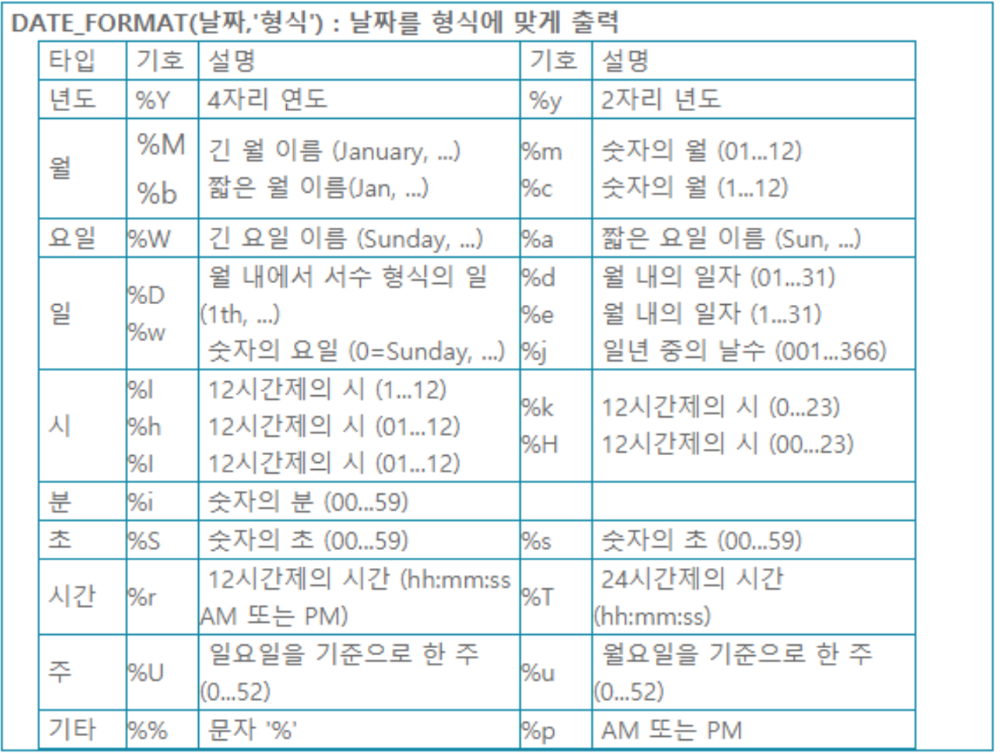
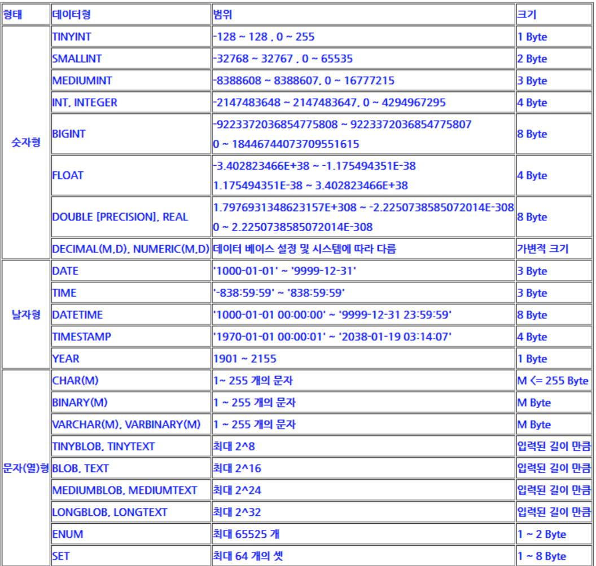

# MySQL_기본

SHOW DATABASES;              <현재 있는 데이터 베이스 이름을 본다.>  
USE 데이터베이스명;              <데이터베이스 이름을 사용한다.>  
CREATE DATABASE 데이터베이스명;  <데이터베이스명으로 데이터베이스를 만듦.>  
DROP DATABASE 데이터베이스명;    <데이터베이스명의 데이터베이스를 삭제>  
  
-DATABASE- : USE 데이터베이스명; 명령으로 사용할 데이터베이스 선택해야함.  
  
SHOW TABLES;                <데이터베이스 안에 선언한 테이블 이름이 출력>  
DESC 테이블명;                <데이터베이스 안의 테이블 이름의 구조를 본다.>  
Ex) DESC aa; 라고 하면 aa라는 테이블 구조가 출력된다.  
  
  
## SQL문  
  * select 문  
[형식]  
select [distinct] {*, column[Alias], ...}  
from 테이블명;  
[where 조건]  
[group by 컬러명]  
[order by 컬럼명 [asc | desc]]  
  
Ex)  
Select * from employee;  
select ename, sal from emp;  
  
  
  * insert 문  
[형식]  
insert into 테이블명 [(컬럼명, ...)] values(값1, ...)  
  
Ex)  
insert into member(id, password, name, email, address)  
values('minnaldo', '1234', '조민', 'minnaldo6602@gmail.com', '광주시');  
  
  
  * update 문  
[형식]  
update 테이블명 set 컬럼명=value,... [where 조건];  
  
Ex)  
update member set address='광주시' where id='min';  
  
  
  * delete 문  
[형식]  
delete from 테이블명 [where 조건];  
  
Ex)  
delete from member where id='min';  
  
  
----------------------------------------------------------  
  
1. 숫자관련 함수  
  
ABS(숫자)               절대값 출력  
CEILING(숫자)           값보다 큰 정수 중 가장 작은 수  
FLOOR(숫자)             값보다 작은 정수 중 가장 큰 수[실수를 무조건 버림]  
                      (음수일 경우는 제외.)  
ROUND(숫자,자릿수)       숫자를 소수점 이하 자릿수에서 반올림.  
                       (자릿수는 양수,0,음수를 갖을 수 있다.)  
TRUNCATE(숫자,자릿수)   숫자를 소수점 이하 자릿수에서 버림.  
POW(X,Y) or POWER(X,Y)  X의 Y승  
MOD (분자, 분모)        분자를 분모로 나눈 나머지를 구한다. (연산자 %와 같음)  
GREATEST(숫자1,숫자2,숫자3) 주어진 수 중 제일 큰 수 리턴.  
LEAST(숫자1,숫자2,숫자3...) 주어진 수 중 제일 작은 수 리턴.  
INTERVAL(a,b,c,d..)   a(숫자)의 위치 반환  
  
  
2. 문자관련 함수  
  
ASCII(문자)           문자의 아스키 코드값 리턴.  
CONCAT('문자열1','문자열2','문자열3'...)  
      문자열들을 이어준다.  
INSERT('문자열','시작위치','길이','새로운문자열')  
      문자열의 시작위치부터 길이만큼 새로운 문자열로 대치  
REPLACE('문자열','기존문자열','바뀔문자열')  
      문자열 중 기존문자열을 바뀔 문자열로 바꾼다.  
INSTR('문자열','찾는문자열')  
      문자열 중 찾는 문자열의 위치값을 출력.  
LEFT('문자열',개수)  
      문자열 중 왼쪽에서 개수만큼을 추출.  
RIGHT('문자열',개수)  
      문자열 중 오른쪽에서 개수만큼을 추출.  
MID('문자열',시작위치,개수)  
      문자열 중 시작위치부터 개수만큼 출력.  
SUBSTRING('문자열',시작위치,개수)  
      문자열 중 시작위치부터 개수만큼 출력.  
LTRIM('문자열')  
      문자열 중 왼쪽의 공백을 없앤다.  
RTRIM('문자열')  
      문자열 중 오른쪽의 공백을 없앤다.  
TRIM('문자열')  
      양쪽 모두의 공백을 없앤다.  
LCASE('문자열') or LOWER('문자열')  
      소문자로 바꾼다.  
UCASE('문자열') or UPPER('문자열')  
      대문자로 바꾼다.  
REVERSE('문자열')  
      문자열을 반대로 나열한다.  
  
  
3. 논리관련 함수 및 기능  
  
case  
    When 조건 then  
    When 조건 then  
    ELSE  
end  
IF(논리식, 참일 때 값, 거짓일 때 값)  
    논리식이 참이면 참일 때 값을 출력하고 논리식이 거짓이면 거짓일 때 출력한다.  
IFNULL(값1,값2)  
    값1이 NULL 이면 값2로 대치하고 그렇지 않으면 값1을 출력  
COALESCE(값1, 값2)  
    값들 중 처음으로 null이 아닌 값을 리턴 전체가 null이면 null 리턴  
  
  
4. 집계 함수  
  
COUNT(필드명)           NULL 값이 아닌 레코드 수를 구한다.  
SUM(필드명)             필드명의 합계를 구한다.  
AVG(필드명)             각각의 그룹 안에서 필드명의 평균값을 구한다.  
MAX(필드명)             최대값을 구한다.  
MIN(필드명)             최소값을 구한다.  
  
  
5. 날짜관련 함수  
NOW() or SYSDATE() or CURRENT_TIMESTAMP()       현재 날짜와 시간 출력  
CURDATE() or CURRENT_DATE()                     현재 날짜 출력  
CURTIME() or CURRENT_TIME()                     현재 시간 출력  
DATE_ADD(날짜,INTERVAL기준값)                     날짜에서 기준값 만큼 더한다.  
  * 기준값 : YEAR, MONTH, DAY, HOUR, MINUTE, SECOND  
DATE_SUB(날짜,INTERVAL 기준값)                    날짜에서 기준값 만큼 뺀다.  
  * 기준값 : YEAR, MONTH, DAY, HOUR, MINUTE, SECOND  
  
YEAR(날짜)            날짜의 연도 출력.  
MONTH(날짜)           날짜의 월 출력.  
MONTHNAME(날짜)       날짜의 월을 영어로 출력.  
DAYNAME(날짜)         날짜의 요일을 영어로 출력.  
DAYOFMONTH(날짜)      날짜의 월별 일자 출력.  
DAYOFWEEK(날짜)       날짜의 주별 일자 출력(일요일(1),월요일(2),...토요일(7))  
WEEKDAY(날짜)         날짜의 주별 일자 출력(월요일(0),화요일(1),...일요일(6))  
DAYOFYEAR(날짜)       일년을 기준으로 한 날짜까지의 날 수.  
WEEK(날짜)            일년 중 몇 번째 주.  
FROM_DAYS(날 수)      00년 00월 00일부터날 수 만큼 경과한 날의 날짜 출력.  
TO_DAYS(날짜)         00년 00월 00일부터 날짜까지의 일자 수 출력.  
  
;  
  
  
  
6. 기타함수  
  
DATABASE()  
    현재의 데이터베이스 이름을 출력한다.  
PASSWORD('문자열')  
    문자열을 암호화한다.  
FORMAT(숫자,소수이하자리수)  
    숫자를 #,###,###.## 형식으로 출력  
  
;  