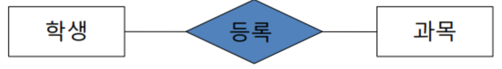

# 데이터베이스 모델링  
## 관계형 데이터베이스  
모든 데이터들을 테이블과 같은 형태로 나타내어 저장하는 데이터베이스
일상 생활에서 데이터를 정리하여 표현할 때 흔히 표와 같은 방법을 사용하게 되는데, 관계형 데이터베이스는 이 '표'의 개념을 상요해서 데이터를 구성하는 방법을 사용  
  
## 데이터베이스 모델링 개요
### 개념적 모델링  
* 업무분석 단계에서 얻어진 내용을 토대로 우선 엔티티(Entity)를 추출하고 엔티티 내에 속성(Attribute)을 구성하며 엔티티 간의 관계를 정의해서 ER-Diagram을 정의하는 단계이다.  

  
  
개체(Entity)  
* 사용자와 관계가 있는 주요 객체, 업무를 위해 데이터로 관리 되어져야 하는 사람, 사물, 장소, 사건 등을 실체(Entity) 라고 한다.  
* 속성(Attribute)을 가져야 한다.  
* 유일한 식별자가 없다면 ENtity가 아니다.  
  
속성(Attribute)  
* 저장할 필요가 있는 실체에 관한 정보  
* 실체(Entity)의 성질, 분류, 수량, 상태, 특성 등을 나타내는 세부사항  
  
식별자  
* 한 실체(Entity) 내에서 인스턴스를 유일하게 구분할 수 있는 단일 속성 또는 속성 그룹  
* 후보키(Candidate Key)  
- 실체 내에서 각각의 인스턴스를 구분할 수 있는 속성으로 기본키가 될 수 있는 후보 속성  
* 기본 키(Primary Key)  
- 실체(Entity)에서 각 인스턴스를 유일하게 식별하는데 가장 적합한 Key
- 기본키 설정시 고려할 사항으로 해당 실체를 대표할 수 있을 것, 업무적으로 활용도가 높을 것, 길이가 짧은 것 등  
* 대체키(Alternate Key)  
- 후보키 중에서 기본키로 선정되지 않은 속성  
* 복합키 (Composite Key)  
- 하나의 속성으로 기본키가 될 수 없는 경우 둘 이상의 컬럼을 묶어서 식별자로 정의하는 경우  
* 대리키(Surrogate Key)  
- 식별자가 너무 길거나 여러 개의 속성으로 구성되어 있는 경우에 인위적으로 추가한 식별자  
  
관계(Relationship)  
* 정의  
- 두 Entity 간의 업무적인 연관성 또는 관련 사실  
* Relationship 분석  
- entity 간에 특정한 관계의 존재 여부 결정  
- 각 Entity 간에 특정한 존재여부 결정  
- 현재의 관계뿐만 아니라 장래에 사용될 경우도 고려  
- relationship matrix 활용  

  
  

관계의 표현  
* 차수성(cardinality)  
- 차수성이란 한 실체의 하나의 인스턴스가 다른 실체의 몇개의 인스턴스와 관련될 수 있는가를 정의  
- * 경우에 따라 발생 횟수 조사  
- * 양쪽 방향 모두 조사  
  
* 선택성(optionality)  
- 선택적(optional)이나 반드시(madatory)를 나타낸다  
- 일반적이고 상식적인 선에서 먼저 판단 
- 항상 그 관계를 만족해야만 하는지 파악 
- 관계가 만족되지 않는 경우를 찾아보고 하나라도 만족되지 않는 경우가 있으면 optional로 표시  
- 양쪽 방향 모두 조사  
  
  
### 논리적 모델링
* 개념적 데이터베이스 모델링 단계에서 정의된 ER-Diagram을 Mapping rule을 적용하여 관계형 데이터베이스 이론에 입각한 스키마를 설계하는 단계와 이를 정규화 하는 단계로 구성 스키마  
- 데이터베이스의 구조로써 데이터베이스 내의 개체와 개체들의 관계, 제약조건 등에 대한 명세  
  

기본키(Primary key)와 포린키&외래키(Foreign Key)  
* 기본키  
- 후보키 중에서 선택한 주 키  
- 널(NULL)을 값으로 가질 수 없다  
- 동일한 값이 중복해서 저장될 수 없다  
  
* 포린키  
- 관계를 맺는 두 엔티티에서 서로 참조하는 릴레이션의 속성으로 지정되는 키 값을 말한다.  
  
부모 개체가 자식 개체에 전이가 될 때, 기본 키를 전이  
이렇게 전이된 키를 외래키라고 하며, 해당 데이터가 있던 없던 상관 없다.  
  
전이된 컬럼(foreign key)가 자식의 primary key로 사용되면 이를 식별관계 일반 column으로 사용되면 비식별관계까 된다.  
  
두 Entity의 1:1의 관계에서는 어느쪽으로 전이되든 상관 없다.  
  
정규화  
  

### 물리적 모델링  
물리적 데이터베이스 모델링 과정  
  
* 논리적 데이터베이스 모델링 단계에서 얻어진 데이터베이스 스키마를 좀 더 효율적으로 구현하기 위한 작업과, DBMS 특성에 맞게 실제 데이터베이스 내의 개체들을 정의하는 단계  
- Column의 domain 설정 (text, integer, real, BLOB, null)  
* 데이터 사용량 분석과 업무 프로세스 분석을 통해서 보다 효율적인 데이터베이스가 될 수 있도록 효과적인 인덱스를 정의하고 상황에 따른 역정규화 작업을 수행함.  
- Index, Trigger, 역정규화  
  

### 인덱스(Index)  
개요  
* 데이터베이스 내의 테이블에서 원하는 데이터를 좀 더 빨리 찾아줄 수 있게끔 데이터의 위치정보를 모아놓은 데이터베이스 내의 개체  
* 정렬된 데이터의 키 값과 해당 키의 주소 정보를 이용  
  
### 효율적인 데이터 검색 방법  
데이터 검색 방법  
* Table Scan (FUll Scan)  
* Index Scan 데이터 검색 유형  
* 포인터 쿼리(Point Query)  
- 단일 건 조회  
* 범위 조회(Range Query)  
- N 건 조회  
* 커버드 조회(Covered Query)  
- 조회의 조건과 대상이 되는 컬럼이 모두 인덱스로 구성된 경우  
  
  
  
# 역정규화(Denomalization)  
정의  
* 시스템 성능을 고려하여 기존 설계를 재구성하는 것  
* 정규화에 위배되는 행위  
* 테이블의 재구성  
  
역정규화 방법  
* 데이터 중복(컬럼 역정규화)  
- 조인 프로세스가 많아 시스템의 성능저하를 가져오는 경우, 조인 프로세스를 줄이기 위해 해당 컬럼을 중복함으로써 성능을 향상시키기 위한 방법  
* 파생 컬럼의 생성  
- 기본적으로 테이블에 없는 컬럼을 숫자 연산이나 데이터 조작 등을 통해 조회할 때 새로운 정보를 보여주는 경우  
- ex) 판매테이블의 판매금액 컬럼이나 성적 테이블의 총점과 평균  
* 테이블 분리  
- 같은 테이블을 기준으로 나눈다  
- 컬럼 기준으로 분리(컬럼수)  
- 레코드 기준으로 분리(레코드 양)  
* 요약 테이블 생성(Summary Table)  
- 조회의 프로세스를 줄이기 위해 요약된 정보만을 저장하는 테이블을 만드는 것  
* 테이블 통합  
- 분리된 두 테이블이 시스템 성능에 영향을 끼칠 경우 고려  
  
튜닝은 데이터가 많이 쌓이는 곳에서 실시한다. 데이터를 자주 호출하는 테이블에 대해 실시