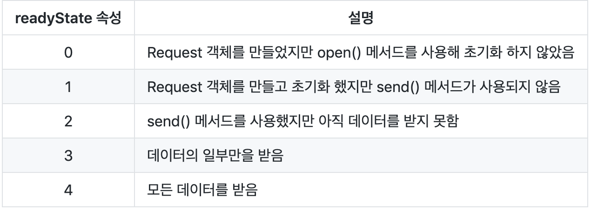

# Java Script SUmmary Week 1  
자바스크립트는 변수에 값을 할당할 때, 변수의 타입이 결정된다.  
세미콜론의 생략이 가능  
  
js :function base lang  
global or function  
var는 영역체크를 위해 var를 안쓰면 전역으로 선언됨.  
  

a();
function a(){
  console.log("a()");
}  
  
var b = function(){
  console.log("b()");
}  
  
a.c = function(){
  console.log("c()");
}  
  
b();  
a.c();  
console.log(b);  
  
// 출력  
// a()  
// b()  
// c()  
// function() { console.log("b()"); }  
  
## 일급함수  
// 일급함수 실행 1  
test(function(){console.log("this is first function")});  
// 일급함수 실행 2  
function  
  
## queryselector  
// 클래스 abc의 색상을 빨간색으로 바꾼다  
document.querySelector('.abc').style.color = 'red';  
  
# jQuery  
var init=function() {
  alert("1111");
}  
// 아래는 모두 init을 window.onload 시점에 실행하는 코드이다.  
jQuery(document).ready(init);  
jQery(init);  
// $ 는 jQeury 를 줄인 것.  
$(init);  
  
jQuery Selector  
  
# AJAX (Asynchronous Javascript nad XML)  
: HTML 페이지는 부분만 바꿀 수 없다 ==> jsp에서 새로운 페이지를 만들어 보내주어야 한다 ==> 페이지가 refresh 되어야 한다. (자원 소모 증가)  
  
자바스크립트를 이용한 개선 가능, 자바스크립트가 직접 서버와 통신을 한다.  
자바스크립트가 갖고 있는 통신모듈을 이용해 통신을 한다.  
  
최근엔, XML 대신 JSon 을 통해 통신을 한다.  
  
## XMLHttpRequest  
* 자바스크립트가 Ajax 를 사용할 때, 사용하는 객체  
* XHR  
: 화면은 그대로 두고, javascript가 XML 을 이용해 통신을 한다.  
  
  
동기, 비동기 모두 사용 가능 대부분 비동기로 사용  
  
// XMLHttpRequest 객체 생성
var request = new XMLHttpRequest();  
  
request.open('GET', "url", false);    // false : 동기 / true : 비동기  
  
// Ajax 수행  
request.send();  
  
// 출력  
document.body.innerHTML = request.responseText;  
  
  
  
  
## JSon  
Json 의 데이터 표현 방식  
  
객체   배열
{}    []  
  
  
<h2>자바스크립트 코드를 실행함으로써 브라우저 내의 글씨나 이미지를 변경할 수 있다. </h2>  
* 프로그래머의 의도대로 동적으로 변할 수 있게 한다.